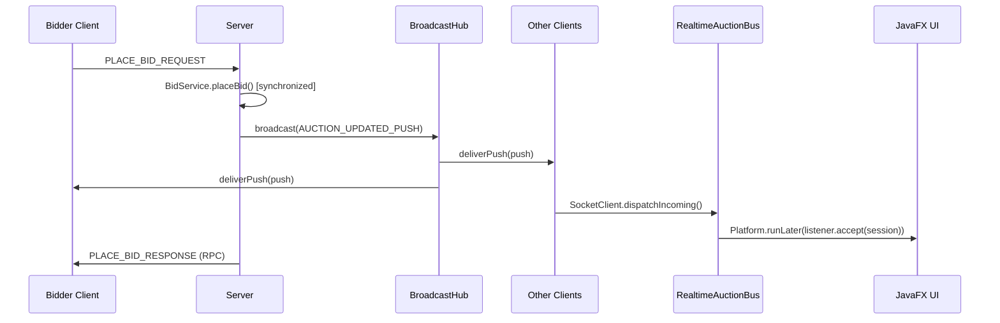

# 🔍 Phân Tích Toàn Diện Hệ Thống Đấu Giá Online

## 1. Tổng Quan Kiến Trúc Repo

Dự án sử dụng **Maven multi-module** với Java 21, gồm 3 module:

```mermaid
graph TD
    subgraph "shared module"
        M[Message / MessageType]
        E[Entity → User/Item/AuctionSession/Bid]
    end
    
    subgraph "client module (JavaFX)"
        CC[ClientConnection ─ Singleton]
        SC[SocketClient ─ reader thread]
        CPH[ClientProtocolHandler ─ RPC façade]
        RAB[RealtimeAuctionBus ─ Observer]
        CTRL[Controllers ─ Login/Bidder/Seller/Items/MyBids]
    end
    
    subgraph "server module"
        SS[SocketServer ─ ThreadPool accept]
        CH[ClientHandler ─ per-client thread]
        SPH[ServerProtocolHandler ─ switch/dispatch]
        CBH[ClientBroadcastHub ─ push to all]
        SVC[Services ─ UserService/AuctionService/BidService]
        DAO[DAOs ─ UserDAO/ItemDAO/AuctionSessionDAO/BidDAO]
        DB[(MySQL Aiven Cloud)]
    end
    
    CTRL --> CPH --> CC --> SC
    SC -.push.-> RAB -.Platform.runLater.-> CTRL
    SC <-->|TCP ObjectStream| CH
    CH --> SPH --> SVC --> DAO --> DB
    SPH --> CBH -.broadcast.-> CH
```

| Module | Vai trò | Công nghệ |
|--------|---------|------------|
| `shared` | Model + Protocol objects dùng chung | Lombok, Java Serialization |
| `client` | JavaFX UI + Socket client | JavaFX, FXML, CSS |
| `server` | Socket server + Business logic + DB | JDBC MySQL, ThreadPool |

---

## 2. Giải Thích Chi Tiết Phần Network

### 2.1 Tổng quan luồng giao tiếp

Hệ thống sử dụng **Java Socket TCP** với **ObjectOutputStream/ObjectInputStream** (Java Serialization) để truyền object `Message` giữa client và server.

Có **hai loại giao tiếp**:
1. **RPC (Request-Response)**: Client gửi request, chờ response — ghép cặp bằng `correlationId`
2. **Server Push**: Server broadcast message đến tất cả client — không cần correlationId

### 2.2 Protocol Layer (`shared.protocol`)

```java
// Message — đơn vị giao tiếp duy nhất qua socket
public class Message implements Serializable {
    MessageType type;      // Loại message (LOGIN_REQUEST, PLACE_BID_RESPONSE, ...)
    Object data;           // Payload (String[], User, AuctionSession, List<>, ...)
    String errorMessage;   // Thông báo lỗi (nếu có)
    boolean success;       // true = thành công
    String timestamp;      // Thời điểm tạo message
    String correlationId;  // UUID ghép request↔response
}
```

```java
// MessageType — enum định nghĩa tất cả loại message
enum MessageType {
    // Auth
    LOGIN_REQUEST, LOGIN_RESPONSE, REGISTER_REQUEST, REGISTER_RESPONSE,
    LOGOUT_REQUEST, LOGOUT_RESPONSE,
    // Auction
    VIEW_AUCTIONS_REQUEST, VIEW_AUCTIONS_RESPONSE,
    CREATE_AUCTION_REQUEST, CREATE_AUCTION_RESPONSE,
    // Bidding
    PLACE_BID_REQUEST, PLACE_BID_RESPONSE,
    GET_BIDS_REQUEST, GET_BIDS_RESPONSE,
    // Push (Server → Client)
    AUCTION_UPDATED_PUSH, AUCTION_CREATED_PUSH,
    // Misc
    ERROR, SUCCESS, ACK
}
```

### 2.3 Client-Side Network Stack

Có **4 class** tạo thành stack hoàn chỉnh:

#### 2.3.1 `ClientConnection` — Singleton quản lý vòng đời kết nối
```
┌─────────────────────────────────────────────┐
│ ClientConnection (Singleton)                │
│ ─ Đọc host/port từ client.properties       │
│ ─ Double-checked locking                    │
│ ─ connectionLock bảo vệ connect/disconnect  │
│ ─ Giữ 1 instance SocketClient duy nhất     │
└─────────────────────────────────────────────┘
```

#### 2.3.2 `SocketClient` — Xử lý I/O socket thực tế

Đây là lớp **quan trọng nhất** trong network client:

```
┌──────────────────────────────────────────────────────────────┐
│  SocketClient                                                │
│                                                              │
│  connect():                                                  │
│    1. Tạo Socket → connect với timeout 5s                    │
│    2. Tạo ObjectOutputStream/ObjectInputStream               │
│    3. Khởi chạy reader thread (daemon)                       │
│                                                              │
│  Reader Thread (readLoop):                                   │
│    while(!stopped):                                          │
│      try:                                                    │
│        Message incoming = readObject()                        │
│        dispatchIncoming(incoming)                             │
│      catch SocketTimeout → continue (keep alive)             │
│                                                              │
│  dispatchIncoming(message):                                  │
│    if correlationId matches pending request:                  │
│      → complete CompletableFuture (RPC response)             │
│    else if AUCTION_*_PUSH:                                   │
│      → RealtimeAuctionBus.dispatch(message)                  │
│                                                              │
│  sendMessage(message):                                       │
│    1. Gán correlationId (UUID) nếu chưa có                   │
│    2. Tạo CompletableFuture, đặt vào pendingRequests map     │
│    3. synchronized(writeLock): writeObject + flush            │
│    4. future.get(60s) — BLOCKING chờ response                │
│    5. Return response Message                                │
│                                                              │
│  Xử lý lỗi: timeout, IOException, mất kết nối               │
│    → failAllPending() + handleConnectionLoss()               │
└──────────────────────────────────────────────────────────────┘
```

**Cơ chế RPC qua correlationId:**
```
Client                              Server
  │                                   │
  │─── Message(LOGIN_REQ, cid=abc) ──►│
  │    pendingRequests["abc"] = fut    │
  │                                   │── handleLoginRequest()
  │◄── Message(LOGIN_RSP, cid=abc) ───│
  │    fut.complete(response)          │
  │    return response                 │
```

#### 2.3.3 `ClientProtocolHandler` — Façade cho Controllers

```
┌────────────────────────────────────────────────────┐
│  ClientProtocolHandler                              │
│                                                    │
│  Cung cấp API đơn giản cho JavaFX controller:     │
│  ─ login(username, password) → User                │
│  ─ register(username, password, email, role) → bool│
│  ─ getActiveAuctions() → List<AuctionSession>      │
│  ─ createAuction(session) → bool                   │
│  ─ placeBid(sessionId, bidderId, amount) → bool    │
│  ─ getBidHistory(sessionId) → List<Bid>            │
│                                                    │
│  Retry logic:                                      │
│  ─ Gửi lần 1 → fail → disconnect → reconnect     │
│  ─ Gửi lần 2 → fail → trả lỗi cho UI            │
│                                                    │
│  Error tracking: lastTransportError                │
└────────────────────────────────────────────────────┘
```

#### 2.3.4 `NetworkCleanup` — Logout + dọn tài nguyên

```
logoutClient():
  1. Gửi LOGOUT_REQUEST tới server
  2. RealtimeAuctionBus.clearAllListeners()
  3. SessionContext.clear()
  4. connection.disconnect()
```

### 2.4 Server-Side Network Stack

#### 2.4.1 `SocketServer` — Accept connections

```
┌──────────────────────────────────────────┐
│  SocketServer                            │
│  ─ ServerSocket.bind(host, port)         │
│  ─ ThreadPool(10 threads)                │
│  while(running):                         │
│    Socket client = accept()              │
│    threadPool.execute(new ClientHandler)  │
└──────────────────────────────────────────┘
```

#### 2.4.2 `ClientHandler` — Một thread per client

```
┌──────────────────────────────────────────────────────┐
│  ClientHandler implements Runnable                    │
│                                                      │
│  run():                                              │
│    1. Tạo Object streams                             │
│    2. ClientBroadcastHub.register(this) ← push hub   │
│    3. while(true):                                   │
│       Message msg = readObject()                      │
│       Message response = protocolHandler.handle(msg)  │
│       sendLocked(response)  ← synchronized(writeLock)│
│    4. finally: unregister + close                    │
│                                                      │
│  deliverPush(push):                                  │
│    ─ Được ClientBroadcastHub gọi                     │
│    ─ sendLocked(push) → ghi push vào stream          │
│                                                      │
│  writeLock:                                          │
│    ─ Serialize RPC response và push messages         │
│    ─ Tránh concurrent write corruption               │
└──────────────────────────────────────────────────────┘
```

#### 2.4.3 `ServerProtocolHandler` — Message dispatcher

```
handleMessage(message):
  switch (message.type):
    LOGIN_REQUEST    → userService.loginUser() → LOGIN_RESPONSE
    REGISTER_REQUEST → userService.registerUser() → REGISTER_RESPONSE
    VIEW_AUCTIONS    → auctionService.getActiveAuctions() → response
    CREATE_AUCTION   → auctionService.createAuction() 
                       + ClientBroadcastHub.broadcast(AUCTION_CREATED_PUSH)
    PLACE_BID        → bidService.placeBid()
                       + ClientBroadcastHub.broadcast(AUCTION_UPDATED_PUSH)
    GET_BIDS         → bidService.getBidHistory()
    LOGOUT_REQUEST   → LOGOUT_RESPONSE("OK")
    default          → ERROR("Unknown message type")
  
  tag(request, response):  // Copy correlationId
```

#### 2.4.4 `ClientBroadcastHub` — Realtime Push

```
┌───────────────────────────────────────────────┐
│  ClientBroadcastHub (static, thread-safe)     │
│  ─ ConcurrentHashMap.newKeySet<ClientHandler> │
│  ─ register(handler)                          │
│  ─ unregister(handler)                        │
│  ─ broadcast(Message push):                   │
│      for each handler: handler.deliverPush()  │
└───────────────────────────────────────────────┘
```

### 2.5 Realtime Update Flow (Observer Pattern)



### 2.6 Concurrency trong BidService

```java
// Lock per session — cho phép bid song song trên các phiên khác nhau
private static final ConcurrentHashMap<Integer, Object> SESSION_BID_LOCKS = new ConcurrentHashMap<>();

public boolean placeBid(int sessionId, int bidderId, double amount) {
    synchronized (lockForSession(sessionId)) {  // ← Lock theo sessionId
        // Đọc session, kiểm tra điều kiện, tạo bid, cập nhật DB
        // Atomic cho mỗi phiên — tránh lost update
    }
}
```

---

## 3. Đánh Giá Hiện Trạng Theo Rubric (Bảng Chấm Điểm)

### Bảng phân tích chi tiết

| # | Tiêu chí | Điểm Max | Trạng thái | Điểm ước tính | Ghi chú |
|---|----------|----------|------------|----------------|---------|
| 1 | Thiết kế lớp & cây kế thừa | 0.5 | ✅ Đạt | **0.5** | Entity → User(Bidder/Seller/Admin), Item(Electronics/Art/Vehicle), AuctionSession, Bid |
| 2 | Nguyên tắc OOP | 1.0 | ✅ Đạt | **1.0** | Encapsulation (Lombok), Inheritance rõ ràng, Polymorphism (getRoleName(), getItemType()), Abstraction (abstract User, Item) |
| 3 | Design Pattern | 1.0 | ⚠️ Thiếu Factory | **0.5** | ✅ Singleton (ClientConnection, DatabaseConnection), ✅ Observer (RealtimeAuctionBus), ❌ **Thiếu Factory Method cho Item** |
| 4 | Quản lý người dùng, sản phẩm | 1.0 | ⚠️ Thiếu CRUD sản phẩm | **0.5** | ✅ Login/Register/Role. ❌ **Thiếu sửa/xóa sản phẩm từ UI**, thiếu quản lý user (admin) |
| 5 | Chức năng đấu giá | 1.0 | ⚠️ Thiếu auto-close | **0.7** | ✅ Place bid, view auctions, create auction. ❌ **Thiếu auto-close phiên khi hết giờ**, thiếu trạng thái OPEN→RUNNING→FINISHED→PAID/CANCELED |
| 6 | Xử lý lỗi & ngoại lệ | 1.0 | ⚠️ Cơ bản | **0.6** | ✅ Bid thấp hơn giá hiện tại, socket timeout/retry. ❌ **Thiếu custom exception**, lỗi chỉ in console không show rõ trên UI |
| 7 | Concurrency | 1.0 | ✅ Tốt | **0.9** | ✅ synchronized per session lock, ConcurrentHashMap. Thiếu stress test chứng minh |
| 8 | Realtime Update (Observer) | 0.5 | ✅ Đạt | **0.5** | ✅ RealtimeAuctionBus, push AUCTION_UPDATED/CREATED, Platform.runLater |
| 9 | Client-Server | 0.5 | ✅ Đạt | **0.5** | ✅ SocketServer + SocketClient, TCP Object stream |
| 10 | MVC | 0.5 | ✅ Đạt | **0.5** | ✅ FXML + Controller (client), Service → DAO (server) |
| 11 | Maven/Convention/Clean code | 0.5 | ⚠️ Tạm | **0.3** | ✅ Maven multi-module. ❌ Checkstyle config có nhưng chưa áp, có code duplicate, comment lẫn tiếng Anh/Việt |
| 12 | Unit Test (JUnit) | 0.5 | ⚠️ Thiếu | **0.3** | ✅ UserDAOTest, BidDAOTest có. ❌ **AuctionTest rỗng**, thiếu test BidService logic, thiếu test concurrency |
| 13 | CI/CD (GitHub Actions) | 0.5 | ✅ Đạt | **0.4** | ✅ maven.yml: compile + test. ❌ Test có thể fail vì phụ thuộc DB cloud |

**Tổng ước tính hiện tại: ~6.7/10** (chưa tính nâng cao)

### Phần nâng cao (bonus 1.5đ)

| # | Tính năng | Điểm | Trạng thái |
|---|-----------|------|------------|
| A | Auto-Bidding | 0.5 | ❌ Chưa có |
| B | Anti-sniping (gia hạn) | 0.5 | ❌ Chưa có |
| C | Bid History Visualization (Line Chart) | 0.5 | ❌ Chưa có |

---

## 4. Phương Án Đạt Full 11 Điểm

### 4.1 Sửa lỗi / bổ sung để đạt 10/10 bắt buộc

#### 🔴 Ưu tiên 1: Design Pattern — Factory Method (thiếu 0.5đ)

**Vấn đề**: Đề bài yêu cầu Factory Method cho Item, hiện tại tạo trực tiếp `new Electronics(...)`, `new Art(...)`.

**Giải pháp**: Tạo `ItemFactory`:
```java
// shared/model/item/ItemFactory.java
public class ItemFactory {
    public static Item createItem(String type, int id, String name, 
                                   String desc, User seller, Object... args) {
        return switch (type.toUpperCase()) {
            case "ELECTRONICS" -> new Electronics(id, name, desc, seller, (int) args[0]);
            case "ART"         -> new Art(id, name, desc, seller, (String) args[0]);
            case "VEHICLE"     -> new Vehicle(id, name, desc, seller, (String) args[0]);
            default -> throw new IllegalArgumentException("Unknown item type: " + type);
        };
    }
}
```
Cập nhật `SellerDashboardController` và `ServerProtocolHandler` để dùng factory.

---

#### 🔴 Ưu tiên 2: Trạng thái phiên đấu giá + Auto-close (thiếu ~0.3đ)

**Vấn đề**: Đề yêu cầu `OPEN → RUNNING → FINISHED → PAID / CANCELED` nhưng hiện tại chỉ có `isActive()` dựa trên thời gian.

**Giải pháp**:
1. Thêm enum `AuctionStatus` vào `AuctionSession`:
```java
public enum AuctionStatus { OPEN, RUNNING, FINISHED, PAID, CANCELED }
```
2. Thêm field `status` vào `AuctionSession` + column trong DB
3. Tạo `AuctionScheduler` trên server: dùng `ScheduledExecutorService` để tự động đóng phiên hết hạn + xác định winner
4. Thêm `closeAuctionIfExpired()` trong `AuctionService`

---

#### 🔴 Ưu tiên 3: Quản lý sản phẩm đầy đủ (thiếu ~0.5đ)

**Vấn đề**: Chỉ có tạo sản phẩm khi tạo auction. Thiếu sửa/xóa sản phẩm, thiếu quản lý user cho Admin.

**Giải pháp**:
1. Thêm `MessageType`: `UPDATE_ITEM_REQUEST/RESPONSE`, `DELETE_ITEM_REQUEST/RESPONSE`
2. Bổ sung handler trong `ServerProtocolHandler`
3. Bổ sung API trong `ClientProtocolHandler`
4. Thêm UI cho Seller quản lý sản phẩm (list, edit, delete)
5. Tạo màn Admin Dashboard (ban user, xem tất cả auction)

---

#### 🟡 Ưu tiên 4: Custom Exception + Error handling chuẩn (thiếu ~0.4đ)

**Vấn đề**: Lỗi chỉ dùng `RuntimeException`, in `e.printStackTrace()`.

**Giải pháp**:
```java
// shared/exception/
public class AuctionException extends Exception { ... }
public class BidTooLowException extends AuctionException { ... }
public class AuctionClosedException extends AuctionException { ... }
public class UnauthorizedRoleException extends AuctionException { ... }
public class InvalidDataException extends AuctionException { ... }
```
- Thay `e.printStackTrace()` bằng proper logging
- Server trả error message cụ thể trong `Message.errorMessage`
- Client hiển thị lỗi thân thiện trên UI

---

#### 🟡 Ưu tiên 5: Unit Test bổ sung (thiếu ~0.2đ)

**Vấn đề**: `AuctionTest.java` rỗng, thiếu test cho business logic.

**Giải pháp**: Viết tests cho:
```
shared/test:
  - AuctionSessionTest: testUpdateCurrentPrice_validBid, testBidTooLow, testBidAfterClose
  - BidTest: testBidCreation

server/test:
  - BidServiceTest: testPlaceBid_concurrent (multi-thread), testPlaceBid_invalidSession
  - AuctionServiceTest: testCreateAuction, testGetActiveAuctions
  - UserServiceTest: testRegisterDuplicate, testLoginInvalid
```

---

#### 🟡 Ưu tiên 6: Code quality (thiếu ~0.2đ)

- Xóa code duplicate (các hàm switch scene lặp đi lặp lại)
- Xóa package `shared.network` (Request/Response) vì không được dùng — gây confused
- Tạo utility class `SceneNavigator` cho việc chuyển scene
- Áp dụng checkstyle
- Thống nhất ngôn ngữ comment

---

### 4.2 Tính năng nâng cao để đạt +1.5đ (→ 11/10)

#### 🟢 Nâng cao A: Auto-Bidding (+0.5đ)

**Thiết kế**:
```java
// shared/model/auction/AutoBidConfig.java
public class AutoBidConfig implements Serializable {
    int bidderId;
    int sessionId;
    double maxBid;
    double increment;
    LocalDateTime registeredAt;
}
```

- Thêm `MessageType.REGISTER_AUTO_BID_REQUEST/RESPONSE`
- Server: `AutoBidService` — khi có bid mới, kiểm tra các auto-bid configs, tự động đặt bid theo priority (thời gian đăng ký) + không vượt maxBid
- Client UI: Form nhập maxBid + increment trong màn đấu giá

---

#### 🟢 Nâng cao B: Anti-sniping (+0.5đ)

**Logic**:
```java
// Trong BidService.placeBid():
if (session.getEndTime().minusSeconds(30).isBefore(LocalDateTime.now())) {
    // Bid trong 30 giây cuối → gia hạn thêm 60 giây
    session.setEndTime(session.getEndTime().plusSeconds(60));
    auctionSessionDAO.updateSession(session);
}
```
- Config: `SNIPE_WINDOW_SECONDS = 30`, `EXTENSION_SECONDS = 60`
- Broadcast push thông báo gia hạn đến tất cả client

---

#### 🟢 Nâng cao C: Bid History Line Chart (+0.5đ)

**Thiết kế**:
- Sử dụng `javafx.scene.chart.LineChart`
- Khi vào chi tiết phiên: load `getBidHistory(sessionId)` → plot
- Khi nhận `AUCTION_UPDATED_PUSH` → thêm điểm mới vào chart realtime
- Trục X: timestamp, Trục Y: bid amount

---

## 5. Thứ Tự Thực Hiện (Roadmap)

> [!IMPORTANT]
> Nếu bạn muốn tôi bắt tay vào code, hãy xác nhận thứ tự ưu tiên và phần nào cần làm trước.

### Phase 1: Fix cơ bản (ước ~2-3 ngày code)
1. ✅ Thêm `AuctionStatus` enum + field + DB column
2. ✅ Tạo `ItemFactory` (Factory Method pattern)
3. ✅ Tạo custom exceptions (`AuctionException` hierarchy)
4. ✅ Bổ sung Unit Tests (`AuctionSessionTest`, `BidServiceTest`)
5. ✅ Cleanup code duplicate, xóa `shared.network` package thừa

### Phase 2: Chức năng thiếu (ước ~2-3 ngày)
6. ✅ Auto-close phiên (`AuctionScheduler`)
7. ✅ CRUD sản phẩm cho Seller (edit/delete item)
8. ✅ Admin Dashboard (ban user, view all)
9. ✅ Error handling chuẩn hóa toàn bộ

### Phase 3: Nâng cao (ước ~2-3 ngày)
10. ✅ Auto-Bidding
11. ✅ Anti-sniping
12. ✅ Bid History Line Chart

### Phase 4: Polish (ước ~1 ngày)
13. ✅ CI fix (test không phụ thuộc DB cloud)
14. ✅ README + docs update
15. ✅ Demo end-to-end rehearsal

---

## 6. Các Vấn Đề Cần Lưu Ý

> [!WARNING]
> **Credential trong source code**: File `DatabaseConnection.java` chứa password DB Aiven cloud hardcode. Nên chuyển sang biến môi trường hoặc file config riêng (đã gitignore).

> [!WARNING]
> **Schema mismatch**: DB schema trong `db.sql` dùng `VARCHAR(255)` cho các ID, nhưng Java code dùng `int`. Cần thống nhất — đề xuất chuyển DB sang `INT AUTO_INCREMENT`.

> [!NOTE]
> **Hai bộ Request/Response thừa**: Package `shared.network` có `Request`/`Response` class nhưng không ai dùng (hệ thống dùng `shared.protocol.Message`). Nên xóa để tránh nhầm lẫn khi chấm.

> [!TIP]
> **BidderDashboard** đang load `ProductCard` mock 4 lần cố định. Cần thay bằng data thực từ `protocol.getActiveAuctions()`.

---

## 7. Tóm Tắt

| Hạng mục | Hiện tại | Mục tiêu |
|----------|----------|----------|
| Điểm bắt buộc | ~6.7/10 | **10/10** |
| Điểm nâng cao | 0/1.5 | **1.5/1.5** |
| **Tổng** | **~6.7** | **11** |

Để đạt full 11 điểm, cần bổ sung khoảng **15 task** chia 4 phase, ước tính **7-10 ngày coding** nếu làm tập trung.
