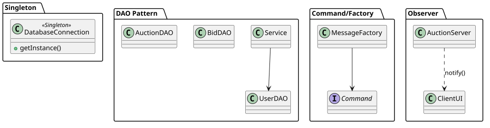
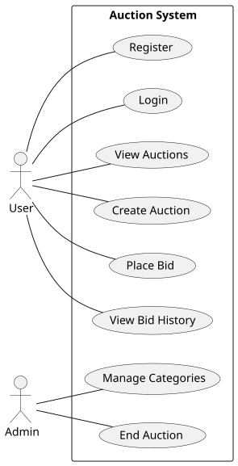
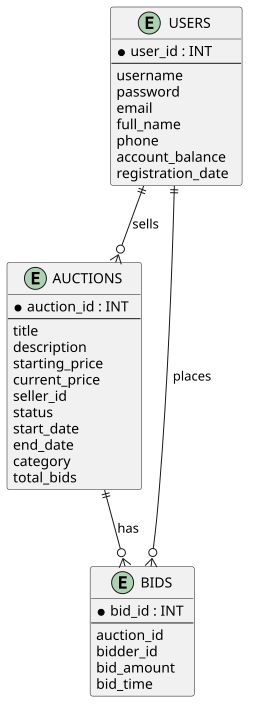

# System Design & Architecture

Tài liệu này tổng hợp các sơ đồ UML/PlantUML đã được rà soát lại theo code hiện tại của dự án Auction System.
Các diagram được giữ ở mức **architecture-level** để dễ đọc; không liệt kê toàn bộ FXML/controller vì số lượng lớn.

## Mapping nhanh giữa diagram và code

| Diagram | Nội dung | Code liên quan |
|---|---|---|
| Architecture | Tổng quan client/shared/server, socket, realtime push, database | `client`, `shared`, `server`, `ClientBroadcastHub`, `SocketClient` |
| Component | Các component runtime chính | `ClientProtocolHandler`, `ServerProtocolHandler`, services, DAOs |
| Shared classes | Domain model và protocol dùng chung | `shared/src/main/java/com/auction/shared/**` |
| Server classes | Network/service/DAO/scheduler/broadcast | `server/src/main/java/com/auction/server/**` |
| Client classes | JavaFX controllers, protocol, cache/session/realtime | `client/src/main/java/com/auction/client/**` |
| Patterns | Factory Method, Singleton/Registry, Observer-like push | `ItemFactory`, `DatabaseConnection`, `ServiceRegistry`, `RealtimeAuctionBus` |
| ER | Database schema và runtime migrations | `database/db.sql`, `UserDAO.initializeSchema()` |
| Sequences | Login và place-bid request/response/push flow | `LoginController`, `BidService`, `SocketClient` |
| State | AuctionSession lifecycle | `AuctionStatus`, `AuctionSession`, `AuctionService` |
| Deployment | Client JAR, server JAR, Aiven MySQL | runtime deployment |

## Diagrams preview

### Architecture / Component

### Class diagrams

### Design patterns

### Use cases and database

### Sequences

### Auction state and deployment

