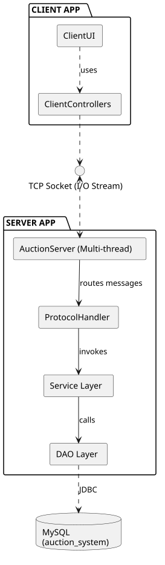
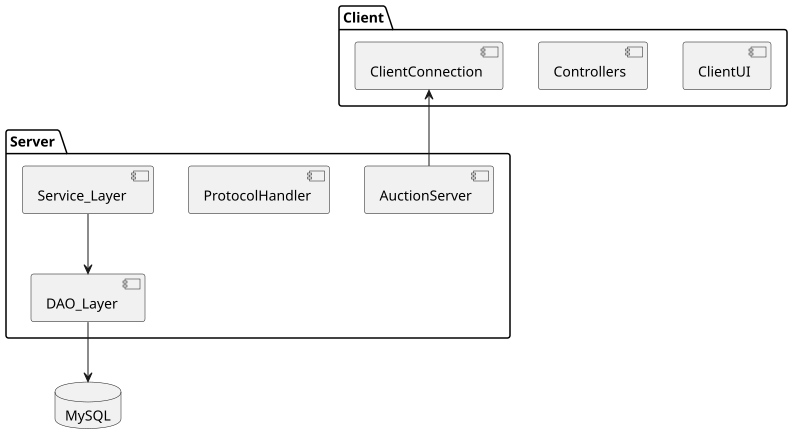
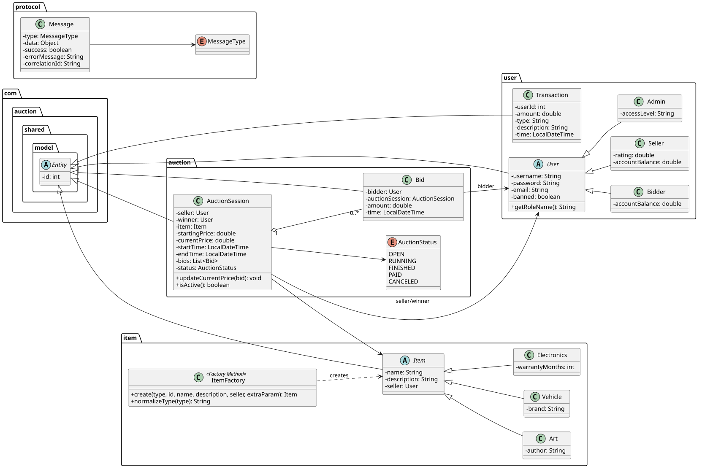
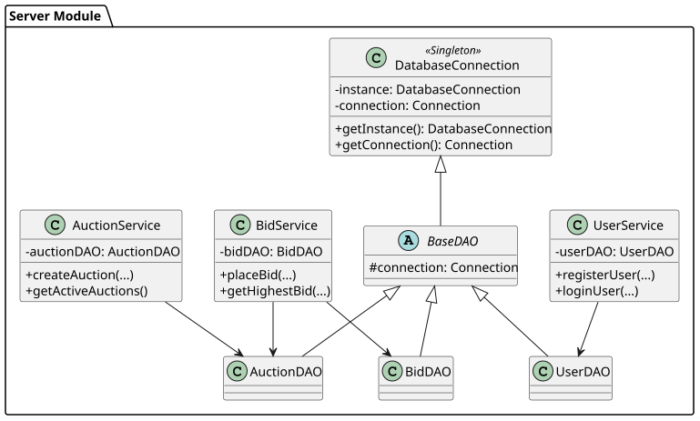
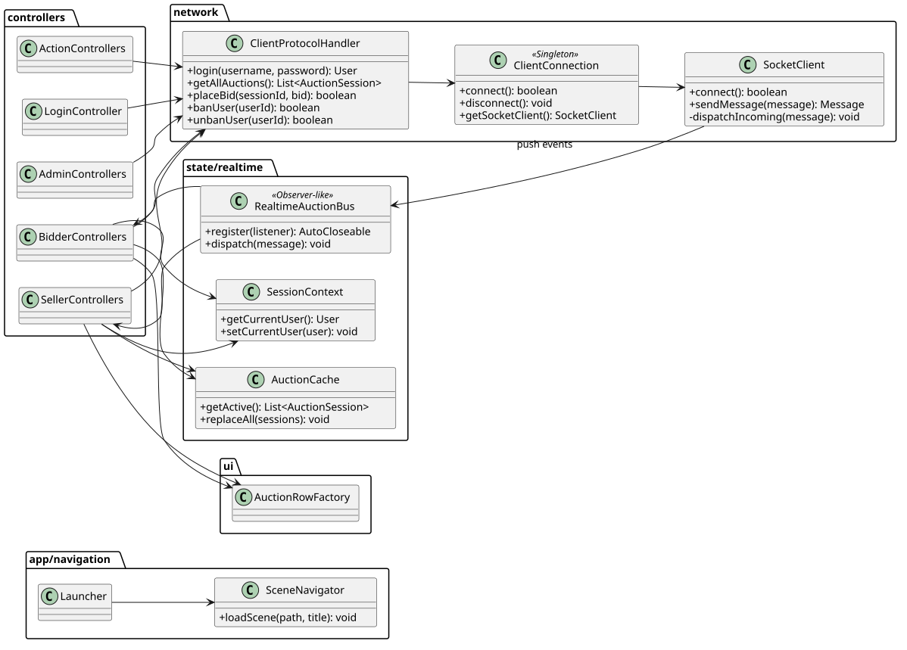
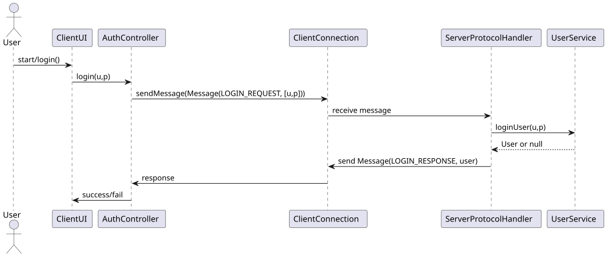
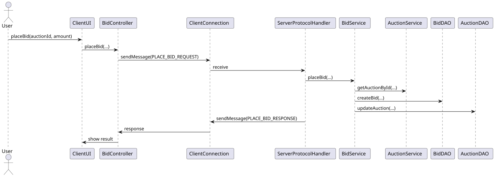
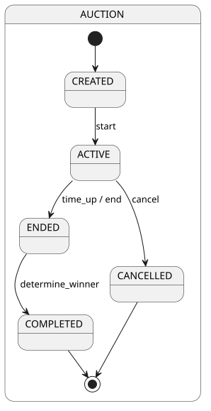
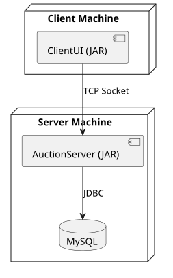

# System Design & Architecture

Tổng quan: mô tả kiến trúc hệ thống, các thành phần và sơ đồ UML.

## Diagrams (preview)
- Architecture / Component  
  

- Component diagram  
  

- Shared classes (models / protocol)  
  

- Server classes (DAO / Service)  
  

- Client classes (Controllers / UI)  
  

- Sequences: Login / Place Bid  
    
  

- State / Activity  
  

- Deployment  
  
